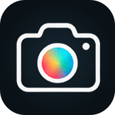

<div align="center">



# ChromaSight

**Real-world color picker for identifying colors using the device camera, with HEX, RGB, and HSL color values.**

[](#changelog)
[](LICENSE)
[](https://devilquest.github.io/ChromaSight/)

**[Open ChromaSight](https://devilquest.github.io/ChromaSight/)**

</div>

---

## Table of Contents
- [About the Project](#about-the-project)
- [Key Features](#key-features)
- [How it Works](#how-it-works)
- [Getting Started](#getting-started)
- [Architecture & Technologies](#architecture-and-technologies)
- [Changelog](#changelog)
- [License](#license)
- [Donations](#donations)

---

## About the Project

ChromaSight is a client-side web application for color measurement. It captures video frames from device cameras, provides an adjustable reticle, and converts sampled pixels to HEX, RGB, and HSL values with matching color names. The application runs offline in the browser without external libraries or network requests.

---

## Key Features

- **Live Camera Sampling**: Reads pixel data from camera frames in real time using the Canvas API.
- **Sampling Precision**: Supports 1-pixel sampling and 5×5 pixel area averaging.
- **Movable Reticle**: Positions the target point across the viewfinder using tap or drag, with double-tap and button recentering.
- **Color Conversion & Naming**: Calculates HEX, RGB, and HSL values with closest color name matching using the CIEDE2000 algorithm.
- **Freeze Frame**: Pauses video streaming to inspect pixels on a static frame.
- **Clipboard Copy**: Copies HEX, RGB, or HSL values directly to the clipboard.
- **Saved Swatches**: Stores copied colors in local storage with a history tray.
- **Hardware Controls**: Toggles the device flashlight and switches between available cameras.

---

## How it Works

1. **Grant camera permission**: Allow camera access when prompted by the browser.
2. **Position the reticle**: Tap or drag across the camera view to aim at a surface. Double-tap or press the target button to center it.
3. **Choose sampling mode**: Select `Point (1px)` for single-pixel readings or `Smooth (5px)` for area averaging.
4. **Freeze the frame**: Press `Freeze` to pause the camera and inspect colors on the static image.
5. **Copy color values**: Click HEX, RGB, or HSL to copy the value to the clipboard.

---

## Getting Started

### Prerequisites

- **Web Browser**: Modern browser with camera support (Chrome, Safari, Firefox, Edge).
- **Secure Context**: Web browsers require HTTPS or `localhost` to access camera hardware.
- **HTTP Server**: Local development server to serve ES modules without CORS restrictions.

### Installation

1. **Clone the repository**:
   ```bash
   git clone https://github.com/Devilquest/ColorWebApp.git
   ```

2. **Navigate to the project root**:
   ```bash
   cd ColorWebApp
   ```

3. **Launch a local server**:
   Using Python:
   ```bash
   python -m http.server 8080
   ```
   Or using Node.js:
   ```bash
   npx serve -l 8080
   ```

4. **Access the application**:
   Open a browser and navigate to `http://localhost:8080`.

---

## Architecture & Technologies <a id="architecture-and-technologies"></a>

### Tech Stack

| Component | Technology | Purpose |
| :--- | :--- | :--- |
| **Markup & Semantics** | HTML5 | Accessible HUD structure and modal dialog markup |
| **Styling & Motion** | Vanilla CSS | Responsive design tokens, viewport units, and micro-interactions |
| **Logic & Engine** | Vanilla JavaScript (ESM) | Canvas image processing, CIEDE2000 color matching, and hardware control |
| **Offline Support** | Web App Manifest | Progressive web application metadata and standalone display mode |

### Project Structure

```text
.
├── css/
│   └── styles.css          Design tokens, responsive layouts, and UI component styling
├── images/
│   └── icon-192.png        Application icon asset
├── js/
│   ├── app.js              DOM bindings, event handling, and camera frame lifecycle
│   ├── color-engine.js     Color space conversions, spatial sampling, and CIEDE2000 matching
│   └── palette.js          Clipboard utilities, haptic triggers, and localStorage persistence
├── index.html              Single-page application layout and accessible HUD markup
└── manifest.json           Progressive Web App configuration and metadata
```

---

## Changelog

### [1.0.0]
- **Added**: Initial release.
  - Camera viewfinder with real-time canvas pixel sampling.
  - Point (1px) and Smooth (5px) sampling radius modes.
  - Movable target reticle with double-tap and button recentering.
  - HEX, RGB, and HSL color value conversion.
  - Color name matching using the CIEDE2000 algorithm.
  - Video freeze and resume controls.
  - Clipboard copy for HEX, RGB, and HSL values.
  - Local swatch history tray with clear controls.
  - Flashlight toggle and camera facing mode switcher.

---

## License

This project is licensed under the [MIT License](LICENSE).

Copyright &copy; 2026 Devilquest.

---

## Donations

**Donations are always greatly appreciated. Thank you for your support!**

<div align="center">
<a href="https://www.buymeacoffee.com/devilquest" target="_blank"></a>
</div>
